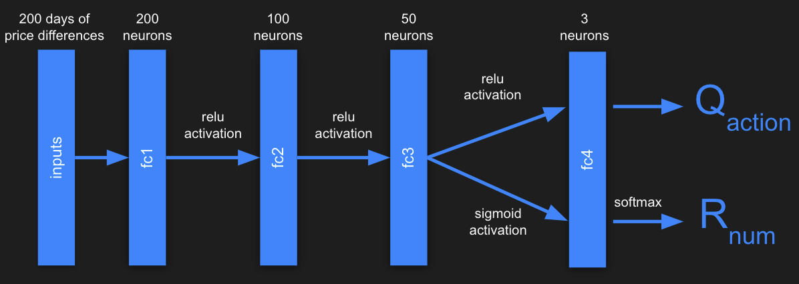
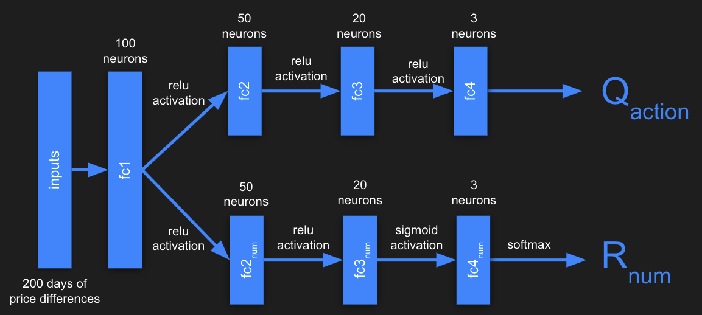
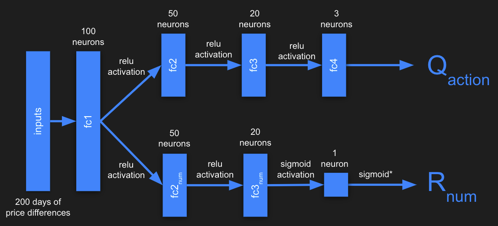
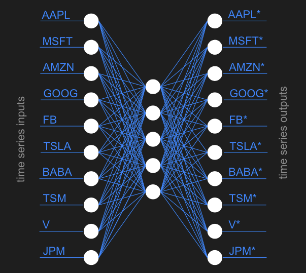

# Deep Q Trading Agent

Here we will demonstrate an implementation of the paper [Improving financial trading decision using deep Q-learning: Predicting the number of shares, action strategies, and transfer learning](https://www.sciencedirect.com/science/article/abs/pii/S0957417418306134) by Jeong et al. This paper covers three separate deep Q-learning architectures, transfer learning, two different means of index component rankings, and action strategies for dealing with confused markets.

Trading agents for finance are nothing new. Previous attempts at creating automated trading systems have used statistical indicators such as moving average to determine how to act at any time. However, most of these agents focus on the action to take, opting to trade a fixed number of shares. This is not realistic for real-world trading scenarios.

This repository contains all of the code you'll need to train and run a deep-Q agent, but if you'd like a deeper understanding of how it all works we've included a tutorial below.

# Tutorial Overview

After following this tutorial you will have completed the following:  
  - Scraped four different stock indices for daily stock data trained  
  - Trained three deep-Q trading architectures:  
    - NumQ, a simple feed-forward network which uses a single branch to determine both the action and number of shares to trade.  
    - NumDReg-AD, an action-dependent network with a branch controlling the action to take and another branch controlling the number of shares to trade.  
    - NumDReg-ID, an action-independent network with two branches as above, but with the number of shares entirely independent of the action taken.  
  - Scraped all components of the four stock indices used above and classified the components using two different methodologies.  
  - Trained an autoencoder, creating a neural basis for stock similarity within an index.  
  - Pretrained multiple models on groups of component stocks within each index.  
  - Trained final models on index data.  
  - Drawn beautiful charts displaying your results.

This tutorial assumes a basic understanding of Python and Pytorch. If you would like to brush up on Pytorch we highly recommend their [tutorials](https://pytorch.org/tutorials/).

# Scraping stock indices

This repository contains a file called `download_stock_data.py`. Edit this file to include the names of the components for each of the following stock indices:
 - Dow Jones Industrial Average (`^DJI`)  
 - S&P 500 (`^GSPC`)  
 - NASDAQ (`^IXIC`)  
 - NYSE (`^NYSE`)  

```python
INDEX_NAME = 'ixic'
COMPONENTS_LIST = ['OPTT', 'NMRK', 'SCOA', ...]
```

Running this file will save each of the components into a directory `raw/{index_name}/` with each component saved as a CSV file.

# NumQ

The Jeong paper experiments with three architectures for trading. The first and simplest of these architectures is called NumQ which uses a single branch of fully-connected layers to determine both the action to take and the ratios for those actions. Its structure is shown below:



This can be succinctly represented in pytorch as a series of `torch.nn.Linear` layers:

```python
class NumQModel(nn.Module):
    def __init__(self):
        super().__init__()
        self.fc1 = nn.Linear(in_features=200, out_features=200, bias=True)
        self.fc2 = nn.Linear(in_features=200, out_features=100, bias=True)
        self.fc3 = nn.Linear(in_features=100, out_features=50, bias=True)
        self.fc_q = nn.Linear(in_features=50, out_features=3, bias=True)

    def forward(self, x: Tensor) -> Tuple[Tensor, Tensor]:
        x = F.relu(self.fc1(x))
        x = F.relu(self.fc2(x))
        x = self.fc3(x)

        q = self.fc_q(F.relu(x))
        r = F.softmax(self.fc_q(torch.sigmoid(x)))

        return q, r

```

Of note in this model are the return values of the `forward()` function. Rather than simply returning one result of a forward-pass through the network, the NumQ network will return two values: a list of Q values associated with the input, and the ratios for each of the three actions (BUY, HOLD, SELL). When in use, the Q values determine which action will be taken, while the ratios determine with how many shares the action will be executed with.

# NumDReg-AD

The second model is a bit more complex. It contains a branch for determining the Q values associated with the input, as well as a separate branch for determining the numbers of shares to trade.



This architecture is quite a bit more involved than NumQ. In fact, this increase in complexity motivates a reduction in each of the fully-connected layers in the network from those in NumQ: 100, 50, 20 versus the 200, 100, 50 used in NumQ. In spite of this adjustment, this and the next model, NumDReg-ID, need to be trained using a three-step training process. The training process will be discussed later on.

```python
class NumDRegModel(nn.Module):
    def __init__(self, method):
        super().__init__()

        # Set method
        self.method = method

        # Training step
        self.step = 0

        # root
        self.fc1 = nn.Linear(in_features=200, out_features=100, bias=True)

        # action branch
        self.fc2_act = nn.Linear(in_features=100, out_features=50, bias=True)
        self.fc3_act = nn.Linear(in_features=50, out_features=20, bias=True)
        self.fc_q = nn.Linear(in_features=20, out_features=3, bias=True)

        # number branch
        self.fc2_num = nn.Linear(in_features=100, out_features=50, bias=True)
        self.fc3_num = nn.Linear(in_features=50, out_features=20, bias=True)
        self.fc_r = nn.Linear(in_features=20, out_features=(3 if self.method == NUMDREG_AD else 1), bias=True)

    def forward(self, x: Tensor) -> Tuple[Tensor, Tensor]:
        # Root
        x = F.relu(self.fc1(x))

        # Action branch
        x_act = F.relu(self.fc2_act(x))
        x_act = F.relu(self.fc3_act(x_act))
        q = self.fc_q(x_act)

        if self.step == 1:
            # Number branch based on q values
            r = F.softmax(self.fc_q(torch.sigmoid(x_act)))
        else:
            # Number branch
            x_num = F.relu(self.fc2_num(x))
            x_num = torch.sigmoid(self.fc3_num(x_num))
            # Output layer depends on method
            if self.method == NUMDREG_ID:
                r = torch.sigmoid(self.fc_r(x_num))
            else:
                r = F.softmax(self.fc_r(x_num))

        return q, r

    def set_step(self, s):
        self.step = s
```

# NumDReg-ID

This is the third and final paper introduced in the paper. It contains an action-independent branch which specifies the number of shares to trade. Its architecture is identical to NumDReg-AD except for the output layer in the number branch which has a size of one. The activation function of the number branch was not specified in the paper, so we opted to use the [sigmoid function](https://en.wikipedia.org/wiki/Sigmoid_function).

(Sigmoid has the convenient property of being bounded between 0 and 1. This avoids the awkward circumstance where the action branch predicts BUY while the number branch predicts a negative number, resulting in a SELL action.)



# Reinforcement learning

Todo. What are actions, rewards, profits, states.

# Training process

Reinforcement learning agents are trained over a number of episodes, during which they observe states, take actions, receive rewards, and observe the next state. These (state, action, reward, next_state) transitions are stored in a memory buffer which the agent then uses to optimize its neural network.

The learning process for deep Q networks is a bit different from normal Q learning models. Deep Q models typically contain two neural networks working in tandem: a policy network which evaluates a given state, and a target network which is periodically updated with the weights from the policy net. This periodic update pattern helps to maintain stability while training.

Our training logic defines an episode as one chronological pass through the training data. This detail is not specified in the paper, but one pass over the data makes logical sense in this context. We used a `TradingEnvironment` class to track information during training, which has the added benefit of making the code more readable. The details of `TradingEnvironment` will be discussed later on.

At the beginning of training, the policy network and target network are initialized. After this, we begin to iterate over a number of episodes.

During an episode, the agent is provided with a state, which you will recall is a sequence of price differences. This state is fed into the policy network, which will calculate Q values and number of shares. We then calculate the reward for each of the three actions and save these rewards in. The (state, action, reward, next_state) transitions for each of the actions are stored in a memory buffer. Next, the model will undergo an optimization step.

During optimization, batch transitions are retrieved from the memory buffer. Then the loss is computed as the difference between actual and expected Q values and backpropagated through the policy net.

After an episode concludes, we do an update of the target network with the policy network and reset the environment to begin serving states from the beginning of the episode again.

# 3 step training (NumDReg-AD/ID)

Todo

# Action strategies in a "confused market"

A confused market is defined as a market situation where it is too difficult to make a robust decision. A "confused market" occurs when the following equation holds:


If agent is in a confused market, pick an action from a predetermined action strategy such as BUY, HOLD, or SELL. Since the goal is to minimize loss caused by uncertain information, we use HOLD.
Our paper did not specify a value for threshold. We found that `THRESHOLD = 0.2` was too high. `THRESHOLD = 0.0002` to worked well.

# Transfer learning

Financial data is noisy and insufficient which leads to overfitting. **Solution**: use transfer learning.  

Before training a model to trade on an index, we train it on stocks that belong to that index, ie. the component stocks.

Then, we use the pretrained weights to further train on the index. Pre-training with all component stocks would be too time consuming, so we create six groups, using two different approaches: **correlation** and **MSE**.

These approaches serve to capture the relationship between a component stock and its index.

## Component stock-index relationships

We create 6 groups of stocks based on 2 approaches: [Pearson correlation](https://en.wikipedia.org/wiki/Pearson_correlation_coefficient) and the mean squared predicting error from an autoencoder (MSE). 


| Correlation          | MSE                  |
| -------------------- | -------------------- |
| Highest 2n           | Highest 2n           |
| Lowest 2n            | Lowest 2n            |
| Highest n + Lowest n | Highest n + Lowest n |

So for each stock we will measure its correlation with the index and measure its autoencoder MSE. One group of stocks will be made up of the highest `2n` components when measured by correlation with the index. (Here `n` is chosen in proportion to the number of components in the index.) Another group will be made up of the `2n` stocks which have the lowest correlation with the index. And so forth.

Creating these groups allows our models to be pretrained on stocks which are proxies to the index, or in the case of the "low" group, on stocks which might help the agent generalize later on.

## Autoencoding component stocks

In order to calculate the mean squared error of the component stocks, we need to train an autoencoder which will predict a series of stock prices for each component in an index. That is, the input size of the network will be MxN, where M is the number of components in the index and N is the number of days in the time series.

We will train an autoencoder such that X=Y, where X is the input and Y is the output. 


The architecture of the autoencoder is very simple, having only 2 hidden layers with 5 units each. These small hidden layers force the model to encode the most essential information of its inputs into a small latent space. All extraneous information not represented in the latent space is discarded. Each of the inputs x<sub>i</sub> will be encoder with the autoencoder as y<sub>i</sub>, and it is against these that mean squared error is measured.



```python
class StonksNet(nn.Module):
    def __init__(self, size):
        super().__init__()
        self.size = size
        self.fc1 = nn.Linear(in_features=size, out_features=5, bias=True)
        self.out = nn.Linear(in_features=5, out_features=size, bias=True)

    def forward(self, x: Tensor) -> Tensor:
        x = F.relu(self.fc1(x))
        x = F.relu(self.out(x))
        return x
```

Training an autoencoder is fairly simple if you understand the basics of neural networks. Rather than training with (input, target) pairs, since we only care that input=input, we will train on (input, input) pairs.

## The Transfer Learning Algorithm

```
Load index data and index component stocks  
Create 6 groups of component stocks using correlation and MSE  
For group in groups:  
    For stock in group:
        Train a model on stock using NumQ. (action branch)
    Evaluate group on index
Pick agent with highest total profit on index
if NumQ:
    Train acion branch on index
else if NumDReg - AD or NumDReg - ID:
    Freeze action branch on index
    Train number branch on index
    Train end to end on index
```

# Finance Environment

For convenience, we include an environment for training which encapsulates many variables that would otherwise need to be tracked in the training loop. Instead, we use the `FinanceEnvironment` to store these variables and provide them as needed to the agent during training.

The `FinanceEnvironment` class exposes only a few necessary methods to the training loop. For example, `step()` returns `state` and `done`. The first of these is the difference in stock prices for the 200 days prior to the current day. The second indicates whether the episode is done. Executing `step()` updates several internal variables used in profit and reward calculations.

The other important method of the environment is `update_replay_memory()`. This method adds a `(state, action, rewards_all_actions, next_state)` transition to the replay memory. This will be sampled later when the model is optimized. Because the environment stores and updates most of these variables internally, they do not clutter up the training loop.

# Putting it all together

How to run this thing

# Selected Results

Some cool graphs
