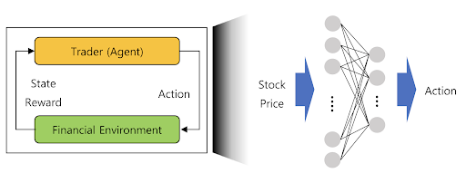
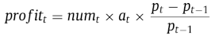
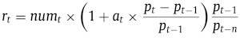
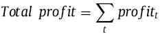
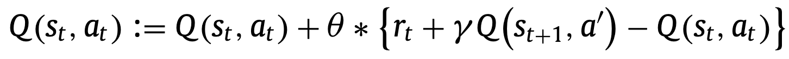
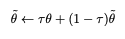
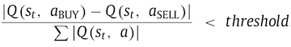
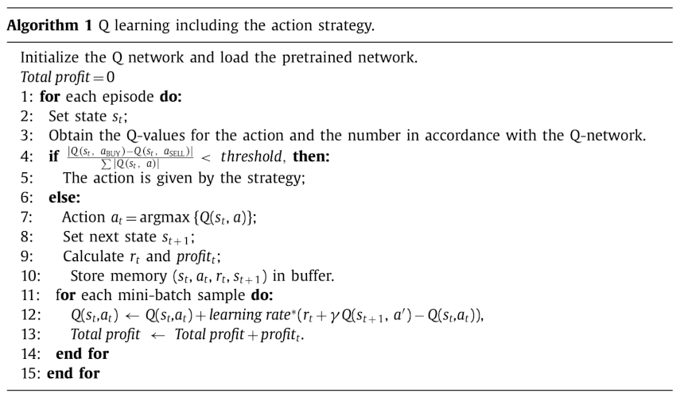
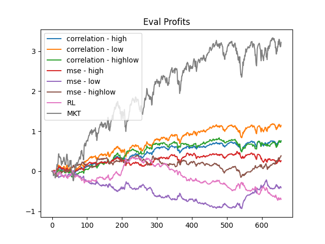
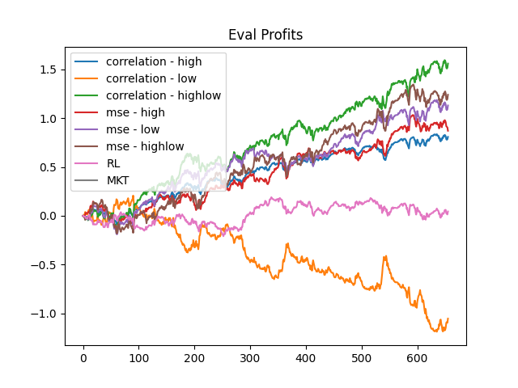

# Deep Q Trading Agent

Here we will demonstrate an implementation of the paper [Improving financial trading decision using deep Q-learning: Predicting the number of shares, action strategies, and transfer learning](https://www.sciencedirect.com/science/article/abs/pii/S0957417418306134) by Jeong et al.  

Trading agents for finance are nothing new. Previous attempts at creating automated trading systems have used statistical indicators such as moving average to determine how to act at any time. However, most of these agents focus on the action to take, opting to trade a fixed number of shares. This is not realistic for real-world trading scenarios. 

This paper adresses three problems.
1. What trading action a trader should perform on a given day, and for how many shares.
2. What action strategy for a trading agent in "confused market".
3. There is a lack of financial data for deep learning, which leads to overfitting. 

The authors if the paper use Reinforcement Learning and transfer learning to tackle these problems. We implement their core idea, which is the combination of a Deep Q Network to evaluate trading actions given a market situation with a Deep Neural Network Regressor to predict the number of shares with which to perform the best action. We implement and present the three Deep Q-learning architectures used in the paper, the transfer learning algorithm used, two different means of index component stock rankings, and action strategies for dealing with what the authors call a "confused market".

We note that the authors make the following assumptions regarding their Reinforcement Learning agent:
- It can perform one action each day: BUY, HOLD, or SELL. 
- It does not need to own the stock before selling it, meaning that shorting is allowed. 
- It has infinite funds, so its trading strategy will not be affected by its online performance. 
- It does not incur transaction fees for any of its actions.

This repository contains all of the code you'll need to train and run a Deep-Q Learning Agent with DNN Regressor, but if you'd like a deeper understanding of how it all works we've included a tutorial and explanations below.

# Tutorial Overview

After following this tutorial you will have completed the following:  
  - Scraped four different stock indices for daily stock data trained  
  - Trained three deep-Q trading architectures:  
    - NumQ, a simple feed-forward network which uses a single branch to determine both the action and number of shares to trade.  
    - NumDReg-AD, an action-dependent network with a branch controlling the action to take and another branch controlling the number of shares to trade.  
    - NumDReg-ID, an action-independent network with two branches as above, but with the number of shares entirely independent of the action taken.  
  - Scraped all components of the four stock indices used above and classified the components using two different methodologies.  
  - Trained an autoencoder, creating a neural basis for stock similarity within an index.  
  - Pretrained multiple models on groups of component stocks within each index.  
  - Trained final models on index data.  
  - Drawn beautiful charts displaying your results.

This tutorial assumes a basic understanding of Python and Pytorch. If you would like to brush up on Pytorch we highly recommend their [tutorials](https://pytorch.org/tutorials/).

# Scraping stock indices

This repository contains a file called `download_stock_data.py`. Edit this file to include the names of the components for each of the following stock indices:
 - Dow Jones Industrial Average (`^DJI`)  
 - S&P 500 (`^GSPC`)  
 - NASDAQ (`^IXIC`)  
 - NYSE (`^NYSE`)  

```python
INDEX_NAME = 'ixic'
COMPONENTS_LIST = ['OPTT', 'NMRK', 'SCOA', ...]
```

Running this file will save each of the components into a directory `raw/{index_name}/` with each component saved as a CSV file.

# Reinforcement learning

The goal is to maximize total profit from trading over a given period. To achieve this, we need to predict the best action to take in a given market situation and the number of shares for which to perform this action. Here's a description of the reinforcement learning problem:



For timestep t:
- p<sub>t</sub> is the closing trade price
- S = {s<sub>1</sub>, s<sub>2</sub>, ... , s<sub>T</sub>} is a state, 
where s<sub>t</sub> = p<sub>t</sub> - p<sub>t-1</sub>, the day-to-day closing trade price difference, from t - 199 to t
- a<sub>t</sub> is the action taken, with values BUY = 1, HOLD = 0, SELL = -1
- num<sub>t</sub> denotes the number of shares at time t
- we denote the profit, profit<sub>t</sub>


- we denote reward, r<sub>t</sub>, and n is some reward window parameter which we set to 100


- total profit at time t is



We use Deep Q Learning to learn optimal action values to maximize total profits, given greedy action policy. 

# Training process

Reinforcement learning agents are trained over a number of episodes, during which they observe states, take actions, receive rewards, and observe the next state. These (state, action, reward, next_state) transitions are stored in a memory buffer which the agent then uses to optimize its neural network.

The learning process for deep Q networks is a bit different from normal Q learning models. Deep Q models typically contain two neural networks working in tandem: a policy network which evaluates a given state, and a target network which is periodically updated with the weights from the policy net. This periodic update pattern helps to maintain stability while training.

Our training logic defines an episode as one chronological pass through the training data. This detail is not specified in the paper, but one pass over the data makes logical sense in this context. We used a `TradingEnvironment` class to track information during training, which has the added benefit of making the code more readable. The details of `TradingEnvironment` will be discussed later on.

At the beginning of training, the policy network and target network are initialized. After this, we begin to iterate over a number of episodes.

During an episode, the agent is provided with a state, which you will recall is a sequence of price differences. This state is fed into the policy network, which will calculate Q values and number of shares. Notice that the next state will not change depending on our action. This means we know the rewards we could have gotten for any action we can take. We then calculate the reward for each of the three actions. The (state, action, rewards, next_state) transitions for each of the actions are stored in a memory buffer. Note that while we select an action foor each state, this is only to track our progress during training, since we already capture the reward for every state. 

Next, the model will undergo an optimization step.

During optimization, batch transitions are retrieved from the memory buffer. Then the loss is computed as the difference between actual and expected Q values and backpropagated through the policy net.

The expected Q values for each action and state pair are simply computed as the sum of the observed reward for taking that action and the discounted Q values generated by the next state.



After an episode concludes, we do an update of the target network with the policy network using a soft or hard update. For a soft update, we update after every optimization step with a tau of 0.0003. For hard updates, we update with a tau of 1 at the end of each episode.



We then reset the environment to begin serving states from the beginning of the episode again.

## The Finance Environment

We include an environment for training which encapsulates many variables that would otherwise need to be tracked in the training loop. We use the `FinanceEnvironment` to store these variables and provide them as needed to the agent during training.

The `FinanceEnvironment` class exposes only a few necessary methods to the training loop. For example, `step()` returns `state` and `done`. The first of these is the difference in stock prices for the 200 days prior to the current day. The second indicates whether the episode is done. Executing `step()` updates several internal variables used in profit and reward calculations.

The other important method of the environment is `update_replay_memory()`. This method adds a `(state, action, rewards_all_actions, next_state)` transition to the replay memory. This will be sampled later when the model is optimized. Because the environment stores and updates most of these variables internally, they do not clutter up the training loop.

## Action strategies in a "confused market"

A confused market is defined as a market situation where it is too difficult to make a robust decision. A "confused market" occurs when the following equation holds:



If agent is in a confused market, pick an action from a predetermined action strategy such as BUY, HOLD, or SELL. Since the goal is to minimize loss caused by uncertain information, we use HOLD. Our paper did not specify a value for threshold. We found that `THRESHOLD = 0.2` was too high. `THRESHOLD = 0.0002` worked well.

## The Deep Q Learning Algorithm:

The Deep Q Learning algorithm used in the paper is shown below:



In our experiments, we ran into some problems and so we introduced a few changes to the algorithm given by the paper:  

**Problem 1**: The agent started falling back on a single action.
- We tried turning off the action strategy
- We tried exploration strategies
- We decided to emulate each action at each step ([Deep Q-trading, Wang et al](http://cslt.riit.tsinghua.edu.cn/mediawiki/images/5/5f/Dtq.pdf)).  
We introduce this change at step 9. Our reasoning is that it provided more training data for Q-function and stabilized learning.

**Problem 2**: When do we update the target network?
- Deep Q Learning can require a lot of experimentation. We did not have much time to perform these experiments, 
so episode, we use soft target updates, that is: &theta<sub>target</sub> = Tau * &theta<sub>policy</sub> + (1 - Tau) * &theta<sub>target</sub> 
using interpolation parameter Tau,

**Problem 3**: The Q function was not adapting quickly to new situations in the market.
- We don’t use Experience Memory Replay (Use random sample of past transitions for minibatch training)
- We use online learning, by storing past N transitions into a memory buffer and use those for minibatch training ([Deep Q-trading, Wang et al](http://cslt.riit.tsinghua.edu.cn/mediawiki/images/5/5f/Dtq.pdf)).  
We use the minibatch size (64) as N.


# Model Architectures
## NumQ

The Jeong paper experiments with three architectures for trading. The first and simplest of these architectures is called NumQ which uses a single branch of fully-connected layers to determine both the action to take and the ratios for those actions. Its structure is shown below:


This can be succinctly represented in pytorch as a series of `torch.nn.Linear` layers:

```python
class NumQModel(nn.Module):
    def __init__(self):
        super().__init__()
        self.fc1 = nn.Linear(in_features=200, out_features=200, bias=True)
        self.fc2 = nn.Linear(in_features=200, out_features=100, bias=True)
        self.fc3 = nn.Linear(in_features=100, out_features=50, bias=True)
        self.fc_q = nn.Linear(in_features=50, out_features=3, bias=True)

    def forward(self, x: Tensor) -> Tuple[Tensor, Tensor]:
        x = F.relu(self.fc1(x))
        x = F.relu(self.fc2(x))
        x = self.fc3(x)

        q = self.fc_q(F.relu(x))
        r = F.softmax(self.fc_q(torch.sigmoid(x)))

        return q, r

```

Of note in this model are the return values of the `forward()` function. Rather than simply returning one result of a forward-pass through the network, the NumQ network will return two values: a list of Q values associated with the input, and the ratios for each of the three actions (BUY, HOLD, SELL). When in use, the Q values determine which action will be taken, while the ratios determine with how many shares the action will be executed with.

## NumDReg-AD

The second model is a bit more complex. It contains a branch for determining the Q values associated with the input, as well as a separate branch for determining the numbers of shares to trade.


This architecture is quite a bit more involved than NumQ. In fact, this increase in complexity motivates a reduction in each of the fully-connected layers in the network from those in NumQ: 100, 50, 20 versus the 200, 100, 50 used in NumQ. In spite of this adjustment, this and the next model, NumDReg-ID, need to be trained using a three-step training process. The training process will be discussed later on.

```python
class NumDRegModel(nn.Module):
    def __init__(self, method):
        super().__init__()

        # Set method
        self.method = method

        # Training step
        self.step = 0

        # root
        self.fc1 = nn.Linear(in_features=200, out_features=100, bias=True)

        # action branch
        self.fc2_act = nn.Linear(in_features=100, out_features=50, bias=True)
        self.fc3_act = nn.Linear(in_features=50, out_features=20, bias=True)
        self.fc_q = nn.Linear(in_features=20, out_features=3, bias=True)

        # number branch
        self.fc2_num = nn.Linear(in_features=100, out_features=50, bias=True)
        self.fc3_num = nn.Linear(in_features=50, out_features=20, bias=True)
        self.fc_r = nn.Linear(in_features=20, out_features=(3 if self.method == NUMDREG_AD else 1), bias=True)

    def forward(self, x: Tensor) -> Tuple[Tensor, Tensor]:
        # Root
        x = F.relu(self.fc1(x))

        # Action branch
        x_act = F.relu(self.fc2_act(x))
        x_act = F.relu(self.fc3_act(x_act))
        q = self.fc_q(x_act)

        if self.step == 1:
            # Number branch based on q values
            r = F.softmax(self.fc_q(torch.sigmoid(x_act)))
        else:
            # Number branch
            x_num = F.relu(self.fc2_num(x))
            x_num = torch.sigmoid(self.fc3_num(x_num))
            # Output layer depends on method
            if self.method == NUMDREG_ID:
                r = torch.sigmoid(self.fc_r(x_num))
            else:
                r = F.softmax(self.fc_r(x_num))

        return q, r

    def set_step(self, s):
        self.step = s
```

## NumDReg-ID

This is the third and final paper introduced in the paper. It contains an action-independent branch which specifies the number of shares to trade. Its architecture is identical to NumDReg-AD except for the output layer in the number branch which has a size of one. The activation function of the number branch was not specified in the paper, so we opted to use the [sigmoid function](https://en.wikipedia.org/wiki/Sigmoid_function).

(Sigmoid has the convenient property of being bounded between 0 and 1. This avoids the awkward circumstance where the action branch predicts BUY while the number branch predicts a negative number, resulting in a SELL action.)


## 3 step training (NumDReg-AD/ID)

The NumDReg-AD and NumDReg-ID models both require a different training process from NumQ to train their two branches. The three-step training process for both of these models is as follows...


Note: we train each step for the same number of episodes

# Transfer learning

Financial data is noisy and insufficient which leads to overfitting. **Solution**: use transfer learning.  

Before training a model to trade on an index, we train it on stocks that belong to that index, ie. the component stocks.

Then, we use the pretrained weights to further train on the index. Pre-training with all component stocks would be too time consuming, so we create six groups, using two different approaches: **correlation** and **MSE**.

These approaches serve to capture the relationship between a component stock and its index.

## Component stock-index relationships

We create 6 groups of stocks based on 2 approaches: [Pearson correlation](https://en.wikipedia.org/wiki/Pearson_correlation_coefficient) and the mean squared predicting error from an autoencoder (MSE). 


| Correlation          | MSE                  |
| -------------------- | -------------------- |
| Highest 2n           | Highest 2n           |
| Lowest 2n            | Lowest 2n            |
| Highest n + Lowest n | Highest n + Lowest n |

So for each stock we will measure its correlation with the index and measure its autoencoder MSE. One group of stocks will be made up of the highest `2n` components when measured by correlation with the index. (Here `n` is chosen in proportion to the number of components in the index.) Another group will be made up of the `2n` stocks which have the lowest correlation with the index. And so forth.

Creating these groups allows our models to be pretrained on stocks which are proxies to the index, or in the case of the "low" group, on stocks which might help the agent generalize later on.

## Autoencoding component stocks

In order to calculate the mean squared error of the component stocks, we need to train an autoencoder which will predict a series of stock prices for each component in an index. That is, the input size of the network will be MxN, where M is the number of components in the index and N is the number of days in the time series.

We will train an autoencoder such that X=Y, where X is the input and Y is the output. 


The architecture of the autoencoder is very simple, having only 2 hidden layers with 5 units each. These small hidden layers force the model to encode the most essential information of its inputs into a small latent space. All extraneous information not represented in the latent space is discarded. Each of the inputs x<sub>i</sub> will be encoder with the autoencoder as y<sub>i</sub>, and it is against these that mean squared error is measured.


```python
class StonksNet(nn.Module):
    def __init__(self, size):
        super().__init__()
        self.size = size
        self.fc1 = nn.Linear(in_features=size, out_features=5, bias=True)
        self.out = nn.Linear(in_features=5, out_features=size, bias=True)

    def forward(self, x: Tensor) -> Tensor:
        x = F.relu(self.fc1(x))
        x = F.relu(self.out(x))
        return x
```

Training an autoencoder is fairly simple if you understand the basics of neural networks. Rather than training with (input, target) pairs, since we only care that input=input, we will train on (input, input) pairs.

## The Transfer Learning Algorithm

```
Load index data and index component stocks  
Create 6 groups of component stocks using correlation and MSE  
For group in groups:  
    For stock in group:
        Train a model on stock using NumQ. (action branch)
    Evaluate group on index
Pick agent with highest total profit on index
if NumQ:
    Train acion branch on index
else if NumDReg - AD or NumDReg - ID:
    Freeze action branch on index
    Train number branch on index
    Train end to end on index
```

# Putting it all together

To run or experiments, we created a command line interface to train a models, run transfer learning, and evaluate saved models.


First, install the required dependencies using pip3 or pip...

```
pip3 install requirements.txt
```

You can also install dependencies with conda...

```
conda env create -f envionment.yml
```

Next, run the following command to clone the repository and move into the directory...

```
git clone https://github.com/lukesalamone/deep-q-trading-agent
cd deep-q-trading-agent/
```

Now we can run experiments from the command line using the following set of arguments...


<b>--task</b>: The task we want to run (train, evaluate, transfer_learning)

<b>--epsd</b>: The number of episodes to run (if running training)

<b>--indx</b>: The index to use for the specified task

<b>--symb</b>: The symbol of what we want to trade (not the same as index in the case of transfer learning)

<b>--eval</b>: The dataset to evaluate the agent on

<b>--mthd</b>: Which model architecture and training method to use (numq, numdregad, numdregid)

<b>--stgy</b>: The default strategy to use in a confused market (buy, hold, sell)

<b>--load</b>: The path to the model to load for the specified task (if blank, we initialize a new model)

<b>--save</b>: The path to where the model should be saved (model will not be saved if path not specified)

Running the following command will train an agent for 3 episodes using the NumQ method to trade the dow jones (DJIA) index and save the weights.

```
python3 trading_agent.py --task train --epsd 3 --mthd numq --indx djia --symb ^DJI --save sample_agent.pt
```

When running training, plots of losses, training and validation rewards, total profits, and running profits over the validation set will also be generated and saved under the plots directory.

The following command loads and runs the agent trained earlier using the same index (DJIA) on the test period.

```
python3 trading_agent.py --task evaluate --eval test --mthd numq --indx djia --symb ^DJI --load sample_agent.pt
```

The following commands can be used to run our experiments from our results.

each method (NumQ, NumDReg-AD, NumDReg-ID) on each index (gspc as example)

```
python3 trading_agent.py --task train --epsd 100 --mthd numq --indx gspc --symb ^GSPC --save numq_gspc.pt
```

```
python3 trading_agent.py --task train --epsd 33 --mthd numdregad --indx gspc --symb ^GSPC --save numdregad_gspc.pt
```

```
python3 trading_agent.py --task train --epsd 33 --mthd numdregid --indx gspc --symb ^GSPC --save numdregid_gspc.pt
```

Note: we train NumDReg-AD and NumDReg-ID for 33 episodes since

The following commands were used to run the transfer learning experiments...

Todo - put in all commands to for experiments we showed...


# Selected Results

## Selected Models without pretraining
We trained the models for 100 episodes and test on two test sets. One that uses the same timeline as the paper and another that uses the more recent data we used for transfer learning.


Results from the paper (2006-2017)
| Model                | Profits              |
| -------------------- | -------------------- |
| NumQ                 | 3.89                 |
| NumDRwg-AD           | 4.87                 |
| NumDRwg-ID           | Not given            |

<br/>

From the same timeline as the paper (2006-2017)
| Model                | Profits              |
| -------------------- | -------------------- |
| NumQ                 | 1.67                 |
| NumDRwg-AD           | 2.63                 |
| NumDRwg-ID           | 6.13                 |

<br/>

From the same timeline as the transfer learning (2015-2020)
| Model                | Profits              |
| -------------------- | -------------------- |
| NumQ                 | -0.342               |
| NumDRwg-AD           | -0.425               |
| NumDRwg-ID           | 2.01                 |

The model results here are in the expected order and still make a profit using the same data, but fall short of the profits achieved by the paper.

<br/><br/>

## Selected Models after pretraining
The following shows the performance of our pretrained agents on NYSE.

## Pretraining on groups

Example: **Numdreg_id**, 15 episodes for each component stock, 33 episodes for Training Steps 2 and 3.  
We can see the performance of agents trained on each group, for example, on GSPC:


Here, we select the group `correlation - highlow` before further training on the index.  
We show the evaluation on the validation set below:


## Selected Models after training

### NumQ
The following shows the performance of NumQ evaluated on NASDAQ.


It is important to note that the data used to do the transfer learning section has a significantly shorter timeline than the data from the paper, limiting the agents' ability to achieve better results.

# Conclusion

While The agents trained here in our experimets make a profits on average, they fall short of the results in the paper. This likely has a few different reasons including...

1. <b>Missing details in the paper</b> including, among other things, how batches for the model optimization step are to be updated, how optimization works for the third step in three step training, how exploration or alternatives to exploration are implemented, and some other smaller details.

2. <b>A different and smaller timeline</b> to train and test the model likely caused lower profits.

3. <b>A problem within the RL process</b> likely is another likely cause of smaller profits. While the losses decrease, and rewards and profits increase as expected and furthermore appear to converge, they do so at a lower level than expected.

Regardless, it is clear the RL agent learns to generate some profits and the proposed modifications in architecture and training process described above do result in the expected improvements in profits.
